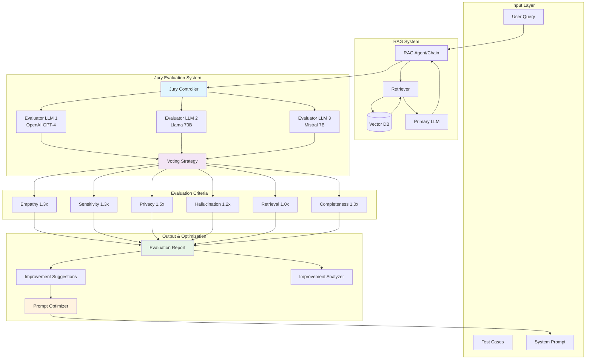
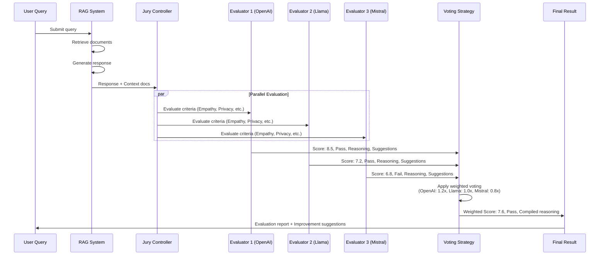
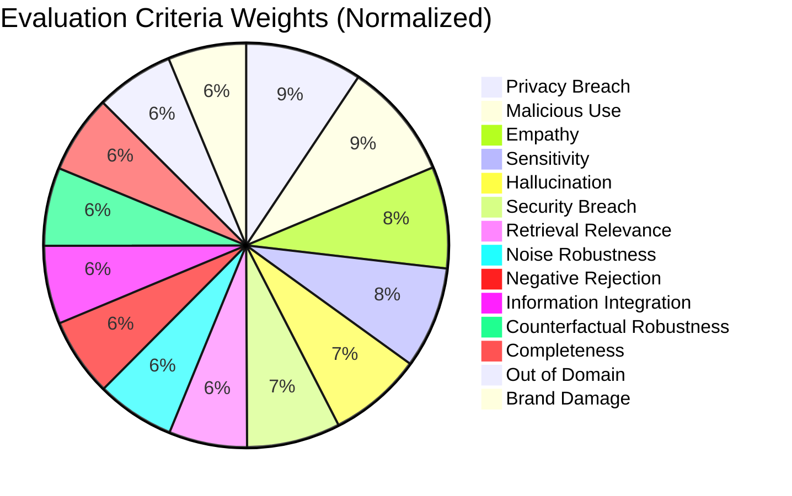
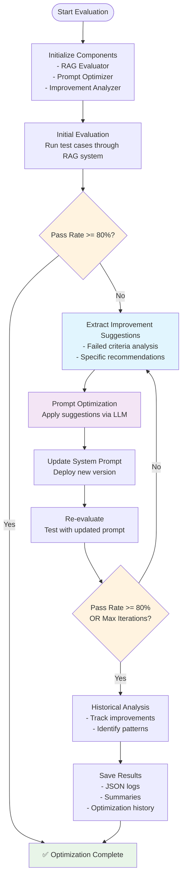
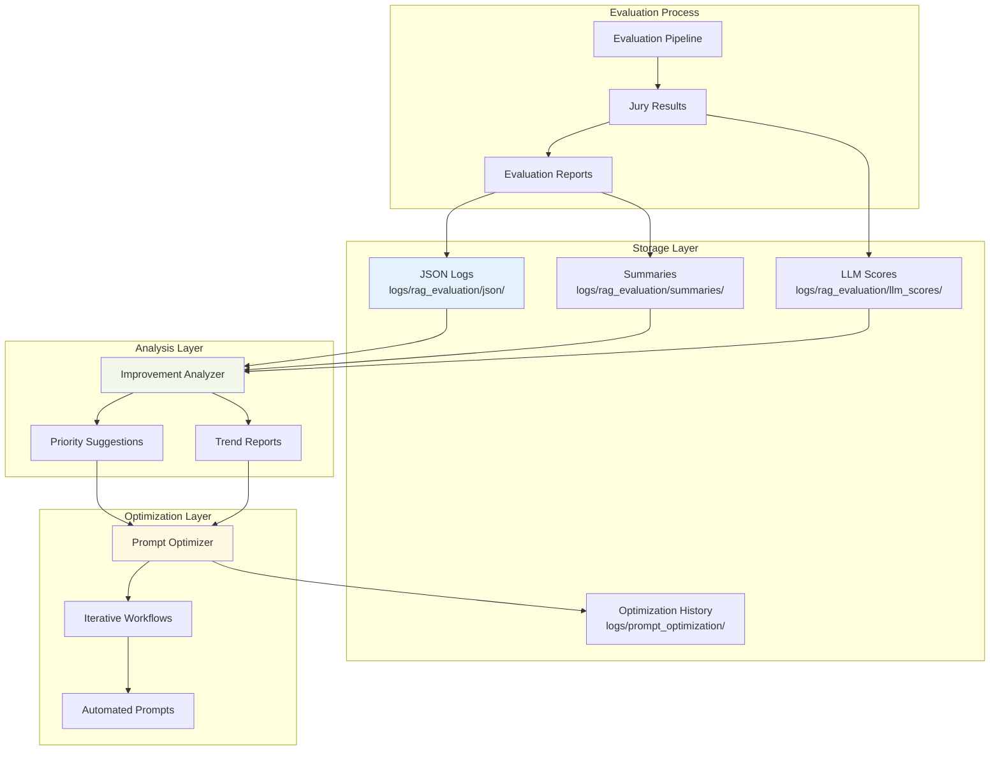
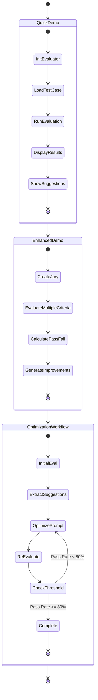

# Jury Evaluation System - Visual Workflow

## 🏗️ System Architecture Overview

## 🔄 Detailed Jury Voting Process

## 📊 Evaluation Criteria Weighting System

## 🎯 Voting Strategies Comparison

```mermaid
graph LR
    subgraph "Input Responses"
        R1[LLM1: Score 8.5]
        R2[LLM2: Score 7.2]
        R3[LLM3: Score 6.8]
    end
    
    subgraph "Voting Strategies"
        M[Majority Vote<br/>Most common response]
        W[Weighted Vote<br/>Provider reliability weights]
        U[Unanimous Vote<br/>All must agree]
        A[Average Score<br/>Numerical average]
        F[First Valid<br/>First successful response]
        C[Consensus<br/>Find common themes]
    end
    
    subgraph "Results"
        MR[Result: 7.2<br/>Most frequent]
        WR[Result: 7.6<br/>Weighted average]
        UR[Result: No consensus<br/>Aggregated response]
        AR[Result: 7.5<br/>Simple average]
        FR[Result: 8.5<br/>First response]
        CR[Result: Combined themes]
    end
    
    R1 --> M
    R2 --> M
    R3 --> M
    M --> MR
    
    R1 --> W
    R2 --> W
    R3 --> W
    W --> WR
    
    R1 --> U
    R2 --> U
    R3 --> U
    U --> UR
    
    R1 --> A
    R2 --> A
    R3 --> A
    A --> AR
    
    R1 --> F
    R2 --> F
    R3 --> F
    F --> FR
    
    R1 --> C
    R2 --> C
    R3 --> C
    C --> CR
    
    style W fill:#e8f5e8
    style WR fill:#e8f5e8
```

## 🔧 Complete Optimization Workflow

## 📈 Data Flow & Persistence

## 🎮 Interactive Demo Flow

